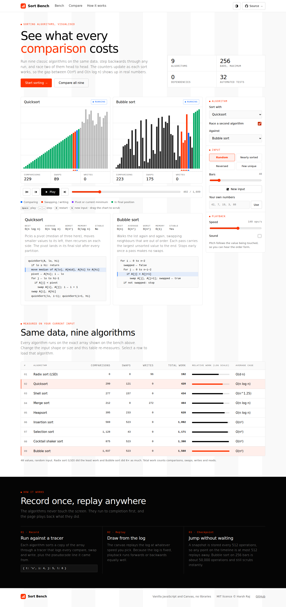

# Sort Bench

An interactive sorting-algorithm visualizer. Watch nine algorithms work one operation at a time, scrub backwards and forwards through the run, and race two algorithms on the same input.

**Live demo:** https://harsh-github007.github.io/sorting-aglo-visualization/



## What it does

- **Nine algorithms:** bubble, cocktail shaker, selection, insertion, Shell, merge, quick (median of three), heap, and LSD radix.
- **Full timeline control:** play, pause, step one operation forward or back, or drag the timeline to any point in the run.
- **Race mode:** run two algorithms side by side on identical input and see which finishes first.
- **Live counters:** comparisons, swaps and writes update as the sort runs, so the difference between O(n²) and O(n log n) is visible in the numbers as well as the bars.
- **Pseudocode tracking:** the line currently executing is highlighted next to the bars.
- **Input shapes:** random, nearly sorted, reversed, few unique, or your own list of numbers. Insertion sort on nearly sorted data versus quicksort on reversed data shows why input shape matters.
- **Measured comparison:** a table runs all nine algorithms on your current input and ranks them by the work they actually did. Click a row to load that algorithm.
- **Sound:** optional tones pitched by the value being touched.
- **Works on any screen:** drag or swipe across the chart to scrub, the playback bar stays within thumb reach on phones, controls grow to finger size on touch screens, and the layout adapts for tablets and landscape phones.
- Light and dark themes, keyboard shortcuts.

| Key | Action |
| --- | --- |
| `Space` | Play / pause |
| `←` `→` | Step back / forward (hold `Shift` for 25 steps) |
| `R` | Restart |
| `N` | New random input |

## How it works

The design separates the algorithms from the animation.

1. **Record.** Each algorithm in `js/algorithms.js` runs once against a *tracer* that performs the real operations on a copy of the array and records each one (`compare`, `swap`, `write`, `pivot`, `range`, `done`) along with the pseudocode line it came from.
2. **Replay.** `js/app.js` replays that operation log onto a `<canvas>`. Because the log is fixed, playback can run at any speed and in either direction.
3. **Checkpoints.** A snapshot of the array is stored every 512 operations, so jumping to any point on the timeline replays at most 512 operations instead of starting over. Scrubbing stays instant even for bubble sort on 256 bars (about 50,000 operations).

Keeping the algorithms free of any drawing code also makes them testable on their own.

## Tests

The test suite runs every algorithm on every input shape at several sizes. For each run it checks that:

- the output is sorted,
- replaying the recorded operation log from the original input gives the same result,
- every bar ends marked as in its final position,
- every operation stays inside the array bounds.

It also checks algorithm-specific properties, such as radix sort making zero comparisons and selection sort making at most n−1 swaps.

```bash
npm test        # Node 18+, no dependencies to install
```

## Running locally

No build step and no dependencies. Open `index.html` in a browser, or serve the folder:

```bash
python3 -m http.server 8000
# then open http://localhost:8000
```

## Project layout

```
index.html              page structure
css/style.css           design tokens, light and dark themes, layout
js/algorithms.js        algorithms, tracer, input generators (no DOM code)
js/app.js               canvas rendering, playback, controls
tests/                  node:test suite for the algorithms
```

## License

MIT © Harsh Raj
